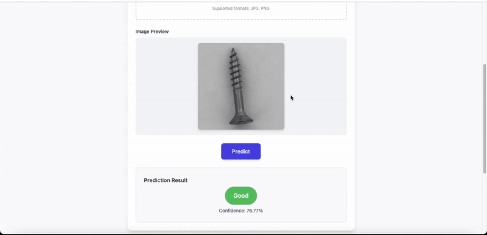

# AI-Based Anomaly Detection in Industrial Screws



[](https://fastapi.tiangolo.com/)
[](https://www.tensorflow.org/)
[](https://www.python.org/)
[](https://tailwindcss.com/)

---

## 🧠 Project Overview

This project aims to automate visual defect detection in industrial screw images using a **deep learning autoencoder**. The system reconstructs input images and flags anomalies based on reconstruction error — offering a faster, more consistent alternative to manual inspection.

---

## 🎓 Academic Context

This work was developed as part of the **Integrated Deep Learning Project** at [Esprit School of Engineering](https://esprit.tn/), under the supervision of **Professor Hannen Ennine**.

---

## ✨ Features

### ✅ Web Interface
- Upload image for real-time defect classification
- Dynamic prediction result with confidence score
- Clean UI built with **Tailwind CSS**

### ✅ Backend
- **FastAPI** handles image upload and model inference
- **TensorFlow Autoencoder** detects anomalies based on reconstruction error
- Confidence score based on how far the reconstruction error is from a learned threshold

### ✅ Model
- CNN-based **autoencoder**
- Trained only on “good” samples
- Anomalies are detected based on deviation from learned patterns

---

## ⚙️ Setup

```bash
# Clone the repo
git clone https://github.com/RideneFiras/anomaly_detection.git
cd anomaly_detection

# Create and activate a virtual environment
python3.11 -m venv venv
source venv/bin/activate

# Install dependencies
pip install -r requirements.txt

# Run the app
uvicorn app:app --reload
```

Then open your browser at [http://127.0.0.1:8000](http://127.0.0.1:8000)

---

## 🗂️ Project Structure

```
├── app.py                  # FastAPI backend
├── index.html              # Frontend web UI (served via FastAPI)
├── autoencoder_model.h5    # Trained autoencoder model
├── screw/                  # MVTec dataset folder (train/test)
│   └── screw/train/good/   # Used during training
│   └── screw/test/         # Used for evaluation
├── assets/                 # Contains demo.gif and other visuals
├── requirements.txt        # Python dependencies
├── README.md               # You're here!
```

---

## 🧪 Model Logic

- Input image is resized and normalized
- Autoencoder reconstructs the image
- Compute **mean squared error (MSE)** between original and reconstruction
- If error > predefined threshold → classify as **Defective**
- Otherwise → **Good**

---

## 🧠 Training Details

- Trained on only `good` images from the MVTec screw dataset
- Validation split: 20%
- Loss: Mean Squared Error (`mse`)
- Optimizer: Adam (`lr=0.0001`)
- Regularization: `Dropout`, `L2`

---

## 🧾 Results

- ✅ **Accuracy:** 99%  
- ✅ **Precision/Recall:** 98%–100% 
- ✅ **Threshold:** ~0.0148 MSE  
- ✅ Real-time prediction via FastAPI 

---

## ✅ Technologies Used

- **Python**
- **TensorFlow / Keras**
- **FastAPI**
- **OpenCV**
- **TailwindCSS**
- **HTML & JavaScript**

---

## 📜 License

This project is for academic purposes only and was developed as part of coursework at Esprit School of Engineering.
